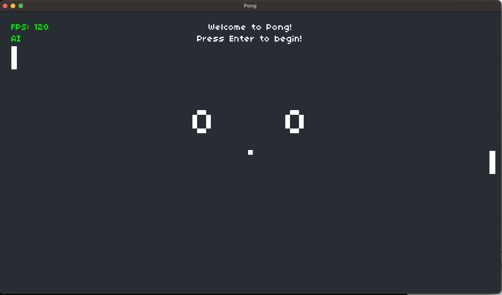

# Pong Clone

A LÖVE 2D clone of the retro Pong game.



## Prerequisites

- Install [LÖVE](https://love2d.org/)

**Note for Mac users: drag the `love` executable to the `Applications` folder.**

## Running the Game

### Mac OS

```bash
git clone https://github.com/f0xtek/pong.git
cd pong
open -n -a love .
```

### Linux

```bash
git clone https://github.com/f0xtek/pong.git
cd pong
love .
```

### Windows

Download this project from [Github](https://github.com/f0xtek/pong) or clone it using [Git for Windows](https://git-scm.com/download/win) etc.

```powershell
cd pong
C:\path\to\love.exe .
```

### AI Mode

By default, pong expects two players, player 1 controlling using `W` and `S` keys, and player 2 controlling using `Up` and `Down` arrow keys.

To enable AI mode for single-player mode, set the `PONG_AI_ENABLED` environment variable to `true`:

Mac/Linux: `export PONG_AI_ENABLED=true`

Windows PowerShell: `$Env:PONG_AI_ENABLED = 'true'`
